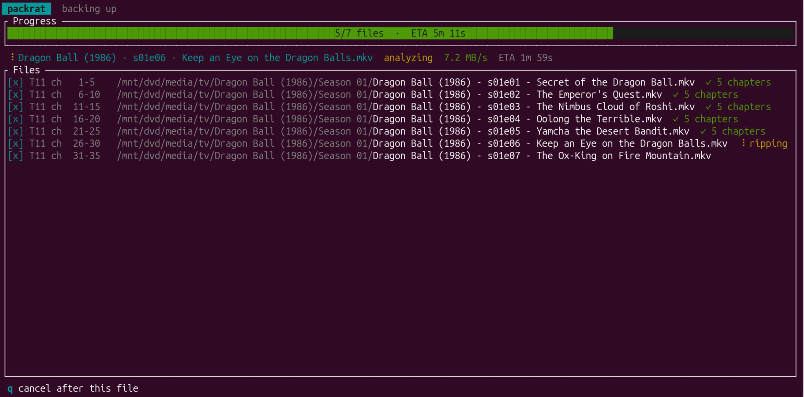

# packrat

A free and open source physical media backup utility.



## Quick start

```sh
packrat
```

Running with no subcommand opens the interactive guide. It detects the disc,
shows what it thinks it is, and asks before writing anything. From there you
can:

- set the **TV directory** and **movie directory** to the folders that already
  hold your show and movie folders, such as an existing Plex library
  (`/mnt/media/tv`, `/mnt/media/movies`). On the first run packrat opens the
  settings screen for this; press `s` to reopen it later. They are remembered
  between runs.
- add an optional **TMDb API key** on the settings screen (or set
  `TMDB_API_KEY`) so movies are named from TMDb. Without a key, movies are named
  from the disc label, so the whole pipeline still works offline.
- pick which drive to read when more than one is attached (`Tab`, `↑`/`↓`,
  `Enter`), and switch drives from a plan with `d`
- correct the **show** and **season** if TVmaze guessed wrong (packrat searches
  TVmaze for the name)
- correct the **movie title and year** if TMDb guessed wrong; when several
  releases match, `[` and `]` cycle through the candidates
- include or skip individual files, and add **extras** (trailers/featurettes).
  A movie disc lists every bonus title next to the feature, so you pick what to
  rip in the one list
- press `x` to open the tray, or enable **Eject when done** in settings (`s`)
  to eject automatically after a clean rip
- press `Enter` to apply edits and `r` to rip

Files are written straight into the configured directory with Plex's naming:

```text
<tv directory>/<Show (Year)>/Season 01/<Show (Year>) - s01e01 - <Episode>.mkv
<movie directory>/<Title (Year)>/<Title (Year)>.mkv
<movie directory>/<Title (Year)>/Other/<Extra>.mkv
```

Leave a directory empty to write plain MKVs into the current directory instead.

A typical session:

1. Run `packrat` with a disc inserted. On the first run, set your TV and movie
   directories on the settings screen and press `Enter` to save and continue.
2. Check the disc packrat found and correct the show or season if it guessed
   wrong (`Enter` re-runs the TVmaze lookup). For a movie, correct the title or
   year; `Enter` re-runs the TMDb lookup.
3. Check the proposed files, unchecking anything you do not want (`Space`).
4. Press `r` to back up. Progress is shown per file, and `q` stops after the
   current file. With **Eject when done** enabled the tray opens once it
   finishes cleanly; otherwise press `x` on the result screen.

`Tab` moves between fields and `?` shows the full key list. Press `s` to change
the storage directories at any time. The guide needs a terminal; for scripting
and headless use see [Advanced usage](advanced.md).
